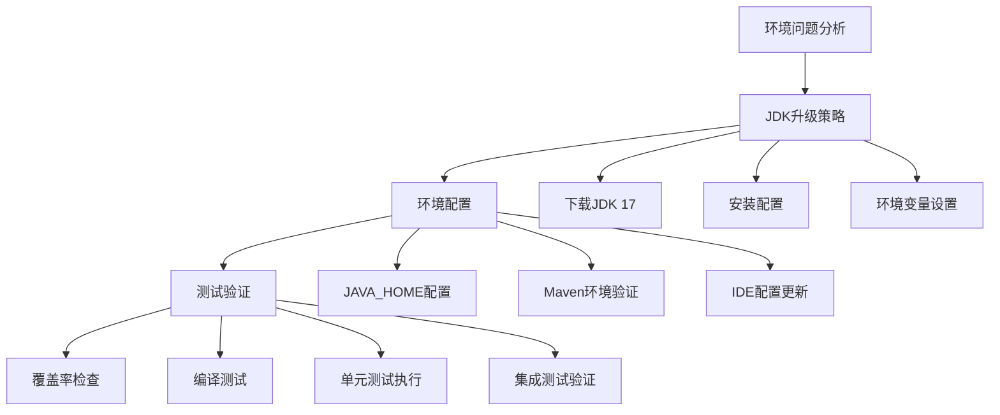
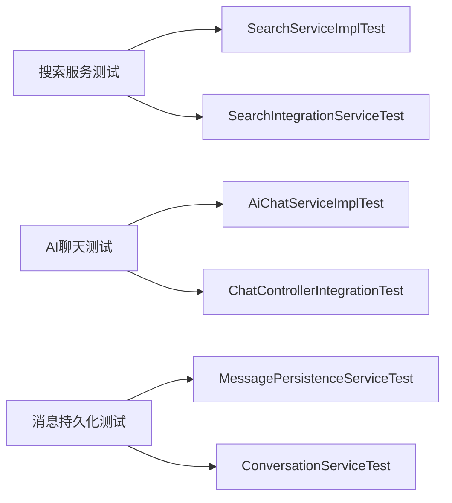

# 修复Maven单元测试环境问题设计文档

## 1. 概述

在搜索服务重构完成后，运行单元测试时遇到Maven环境问题。经过分析发现主要问题是Java版本不匹配：项目pom.xml配置使用Java 17，但运行环境是Java 1.8.0_442。

## 2. 问题识别

### 2.1 Java版本冲突
- **项目配置**：pom.xml中配置的Java版本为17
- **运行环境**：实际运行环境为Java 1.8.0_442
- **根本原因**：运行环境JDK版本过低，需要升级到JDK 17

### 2.2 环境依赖要求
- Spring Boot 3.4.2 要求 Java 17+
- MyBatis Spring Boot Starter 3.0.4 要求 Java 17+
- Spring AI 1.0.0-M6 要求 Java 17+
- 项目配置完全正确，只需匹配运行环境

## 3. 解决方案架构



## 4. 具体修复方案

### 4.1 JDK版本管理工具安装（推荐）

#### 4.1.1 推荐方案：Jabba (Windows 原生)
**Jabba** 是专门为Windows设计的Java版本管理器，支持原生PowerShell和CMD。

**安装方式**：
```powershell
# PowerShell中执行
Invoke-Expression (
  Invoke-WebRequest https://github.com/shyiko/jabba/raw/master/install.ps1 -UseBasicParsing
).Content
```

**使用方法**：
```cmd
# 列出可用的Java版本
jabba ls-remote

# 安装JDK 17
jabba install openjdk@1.17.0

# 切换到JDK 17
jabba use openjdk@1.17.0

# 设置为默认版本
jabba alias default openjdk@1.17.0

# 验证当前版本
java -version
```

#### 4.1.2 备选方案：SDKMAN! (通过WSL)
如果您使用WSL (Windows Subsystem for Linux)：

```bash
# 在WSL中安装SDKMAN!
curl -s "https://get.sdkman.io" | bash
source "$HOME/.sdkman/bin/sdkman-init.sh"

# 安装JDK 17
sdk install java 17.0.9-tem

# 切换版本
sdk use java 17.0.9-tem

# 设置默认版本
sdk default java 17.0.9-tem
```

#### 4.1.3 手动安装方式（不推荐）
如果不使用版本管理工具：
- **推荐版本**：OpenJDK 17 LTS 或 Oracle JDK 17
- **下载地址**：
  - OpenJDK: https://adoptium.net/temurin/releases/
  - Oracle JDK: https://www.oracle.com/java/technologies/downloads/#java17

```cmd
# Windows环境变量设置
JAVA_HOME=C:\Program Files\Java\jdk-17
PATH=%JAVA_HOME%\bin;%PATH%
```

### 4.2 Maven环境配置

#### 4.2.1 Maven JDK配置
```xml
<!-- 保持现有pom.xml配置不变 -->
<properties>
    <java.version>17</java.version>
    <maven.compiler.source>17</maven.compiler.source>
    <maven.compiler.target>17</maven.version>
</properties>
```

#### 4.2.2 Maven环境变量
**使用Jabba时**：
```cmd
# Jabba会自动管理JAVA_HOME，无需手动设置
# 只需确保Maven环境变量
MAVEN_OPTS=-Dfile.encoding=UTF-8
```

**验证Maven使用正确JDK**：
```cmd
# 检查Maven使用的Java版本
mvn -version
# 应该显示Java version: 17.x.x
```

### 4.3 IDE配置更新

#### 4.3.1 IDEA配置
**使用Jabba时**：
- IDEA会自动检测到Jabba管理的JDK
- **File → Project Structure → Project SDK** 选择JDK 17
- **Language Level**：17 - Sealed types, always-strict floating-point semantics
- **Build Tools → Maven → Runner → JRE** 选择JDK 17

#### 4.3.2 VSCode配置
**使用Jabba时**：
```json
{
    "java.configuration.runtimes": [
        {
            "name": "JavaSE-17",
            "path": "C:\\Users\\{username}\\.jabba\\jdk\\openjdk@1.17.0"
        }
    ],
    "java.compile.nullAnalysis.mode": "automatic",
    "java.configuration.detectJdksAtStart": true
}
```

#### 4.3.3 版本切换便利性
使用Jabba的优势：
- **项目级别切换**：每个项目可以指定不同的Java版本
- **全局默认版本**：设置系统默认Java版本
- **临时切换**：在当前命令行会话中临时使用特定版本
- **IDE自动识别**：现代IDE都能自动识别Jabba管理的JDK

## 5. 现有配置验证

### 5.1 编译器插件验证
```xml
<!-- 现有配置保持不变，已经正确配置JDK 17 -->
<plugin>
    <groupId>org.apache.maven.plugins</groupId>
    <artifactId>maven-compiler-plugin</artifactId>
    <version>3.11.0</version>
    <configuration>
        <release>17</release>
    </configuration>
</plugin>
```

### 5.2 插件版本验证
- **JaCoCo**: 0.8.11 - 支持JDK 17
- **Spring Boot Maven Plugin**: 与Spring Boot 3.4.2匹配
- **PMD Plugin**: 3.17.0 - 支持JDK 17
- **Spotless Plugin**: 2.27.2 - 支持JDK 17

## 6. 测试执行策略

### 6.1 测试分类
- **单元测试**：服务层核心逻辑测试
- **集成测试**：控制器与Web层测试
- **组件测试**：搜索服务重构验证

### 6.2 测试覆盖率要求
- 指令覆盖率：≥85%
- 分支覆盖率：≥85%
- 行覆盖率：≥85%

### 6.3 重点测试验证


## 7. 验证检查清单

### 7.1 编译验证
- [ ] `mvn clean compile` 成功执行
- [ ] 所有Java源文件编译通过
- [ ] 依赖解析无冲突

### 7.2 测试执行验证
- [ ] `mvn test` 完整执行
- [ ] 所有单元测试通过
- [ ] 集成测试正常运行
- [ ] 搜索服务重构测试验证通过

### 7.3 覆盖率验证
- [ ] JaCoCo覆盖率报告生成
- [ ] 达到85%覆盖率阈值
- [ ] 核心业务逻辑全覆盖

### 7.4 代码质量验证
- [ ] P3C代码规范检查通过
- [ ] Spotless格式化检查通过
- [ ] 无编译警告

## 8. 实施步骤

### 8.1 推荐流程（使用Jabba）

1. **安装Jabba**：
   ```powershell
   # PowerShell中执行
   Invoke-Expression (
     Invoke-WebRequest https://github.com/shyiko/jabba/raw/master/install.ps1 -UseBasicParsing
   ).Content
   ```

2. **重启命令行**：使Jabba命令生效

3. **安装JDK 17**：
   ```cmd
   jabba install openjdk@1.17.0
   jabba use openjdk@1.17.0
   jabba alias default openjdk@1.17.0
   ```

4. **验证安装**：
   ```cmd
   java -version
   javac -version
   mvn -version
   ```

5. **IDE配置更新**：在IDEA或VSCode中选择新的JDK 17

6. **清理缓存**：
   ```cmd
   mvn clean
   ```

7. **编译测试**：
   ```cmd
   mvn compile
   ```

8. **运行测试**：
   ```cmd
   mvn test
   ```

9. **验证覆盖率**：检查JaCoCo报告

### 8.2 传统方式（不推荐）

1. **环境准备**：备份当前JAVA_HOME配置
2. **JDK安装**：下载并安装JDK 17
3. **环境变量**：配置JAVA_HOME和PATH
4. **版本验证**：确认java -version显示17版本
5. **IDE配置**：更新开发环境SDK设置
6. **依赖刷新**：mvn clean 清理缓存
7. **编译测试**：mvn compile 验证编译
8. **测试执行**：mvn test 运行完整测试套件
9. **覆盖率检查**：验证JaCoCo覆盖率报告
10. **验证确认**：确保所有测试通过并达到覆盖率要求

## 9. 风险控制

### 9.1 功能兼容性
- JDK 17向后兼容，不影响现有功能
- 搜索服务重构功能保持稳定
- AI聊天和SSE流式响应正常工作

### 9.2 性能优化
- JDK 17性能优于JDK 8，提升应用性能
- 更好的垃圾回收机制
- 改进的JIT编译器优化

### 9.3 环境回退策略
- 保留JDK 8安装，可通过JAVA_HOME切换
- 记录原始环境变量配置
- 准备JDK版本切换脚本