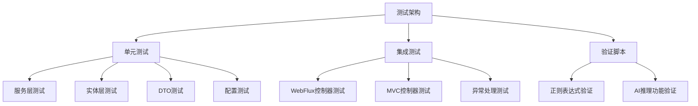

# SpringAI Chat 测试问题修复设计方案

## 1. 概述

本文档旨在修复SpringAI Chat项目中的所有测试问题，确保测试无错误运行，代码覆盖率达到85%的标准，同时保证不改变源码的业务逻辑行为。

## 2. 项目架构分析

### 2.1 技术栈
- **测试框架**: JUnit 5, Mockito, Spring Boot Test
- **响应式测试**: Reactor Test (StepVerifier)
- **集成测试**: @WebFluxTest, @WebMvcTest
- **代码覆盖率**: JaCoCo (目标：85%覆盖率)
- **数据库**: H2内存数据库(测试环境)

### 2.2 测试架构类型


## 3. 现有测试问题分析

### 3.1 配置问题

#### 3.1.1 测试Profile配置不一致
- **问题**: 部分测试类缺少`@ActiveProfiles("test")`注解
- **影响**: 测试可能使用生产环境配置导致失败
- **修复**: 统一添加`@ActiveProfiles("test")`注解

#### 3.1.2 MyBatis测试配置问题
- **问题**: MyBatis配置中`log-impl`属性配置错误
- **影响**: 测试启动时配置绑定失败
- **修复**: 更正配置为`org.apache.ibatis.logging.stdout.StdOutImpl`

### 3.2 依赖注入问题

#### 3.2.1 Mock对象配置不完整
- **问题**: 部分测试类中Mock对象缺少必要的`lenient()`配置
- **影响**: 严格模式下Mockito可能报错
- **修复**: 添加`@Mock(lenient = true)`或使用`@MockitoSettings(strictness = Strictness.LENIENT)`

#### 3.2.2 集成测试上下文加载问题
- **问题**: 部分集成测试加载不必要的组件导致测试失败
- **影响**: 测试环境初始化失败
- **修复**: 精确配置测试上下文，只加载必要的组件

### 3.3 响应式流测试问题

#### 3.3.1 StepVerifier断言不完整
- **问题**: 部分响应式流测试缺少完整的事件验证
- **影响**: 测试覆盖率不足，可能遗漏bug
- **修复**: 完善StepVerifier断言链

#### 3.3.2 异步操作超时处理
- **问题**: 异步测试缺少超时处理机制
- **影响**: 测试可能无限等待
- **修复**: 添加超时配置和错误处理

### 3.4 数据库相关测试问题

#### 3.4.1 测试数据隔离问题
- **问题**: 测试间数据污染
- **影响**: 测试结果不稳定
- **修复**: 使用`@DirtiesContext`或`@Transactional`确保数据隔离

#### 3.4.2 H2数据库模式不兼容
- **问题**: H2数据库SQL方言与MySQL不完全兼容
- **影响**: 某些SQL语句在测试环境失败
- **修复**: 调整H2配置使其更好地模拟MySQL

## 4. 测试修复策略

### 4.1 配置统一化

#### 4.1.1 测试配置文件规范
```yaml
# application-test.yml标准配置
spring:
  profiles:
    active: test
  datasource:
    driver-class-name: org.h2.Driver
    url: jdbc:h2:mem:testdb-${random.uuid};MODE=MySQL;DB_CLOSE_DELAY=-1
    username: sa
    password: ""
  
mybatis:
  configuration:
    log-impl: org.apache.ibatis.logging.stdout.StdOutImpl
    map-underscore-to-camel-case: true
```

#### 4.1.2 统一测试注解
```java
// 服务层测试标准注解
@ExtendWith(MockitoExtension.class)
@MockitoSettings(strictness = Strictness.LENIENT)
@ActiveProfiles("test")

// 集成测试标准注解
@WebMvcTest(controllers = ControllerClass.class)
@ActiveProfiles("test")
@ContextConfiguration(classes = {ControllerClass.class, GlobalExceptionHandler.class})
```

### 4.2 Mock配置优化

#### 4.2.1 Mock对象统一配置模式
```java
@BeforeEach
void setUp() {
    // 通用Mock配置
    lenient().when(mockService.method()).thenReturn(defaultValue);
    
    // 响应式Mock配置
    when(reactiveService.method()).thenReturn(Mono.just(result));
    when(reactiveService.streamMethod()).thenReturn(Flux.just(event1, event2));
}
```

#### 4.2.2 响应式流Mock标准化
```java
// SSE事件流Mock
Flux<SseEventResponse> mockEvents = Flux.just(
    SseEventResponse.start("开始"),
    SseEventResponse.chunk("内容"),
    SseEventResponse.end(messageId)
);
when(aiChatService.streamChat(anyLong(), anyString(), anyBoolean(), anyBoolean()))
    .thenReturn(mockEvents);
```

### 4.3 测试用例完善

#### 4.3.1 服务层测试覆盖率提升
- **正常流程测试**: 验证基本功能正确性
- **边界条件测试**: null值、空字符串、极值处理
- **异常流程测试**: 数据库异常、网络异常、业务异常
- **并发场景测试**: 响应式流并发处理

#### 4.3.2 控制器层集成测试强化
- **HTTP请求参数验证**: 有效参数、无效参数、边界值
- **响应格式验证**: JSON结构、状态码、错误信息
- **SSE流测试**: 事件格式、流式传输、连接管理

### 4.4 异常处理测试

#### 4.4.1 全局异常处理器测试
```java
@Test
void shouldHandleBusinessException() {
    BusinessException exception = new BusinessException("业务错误");
    ApiResponse<?> response = globalExceptionHandler.handleBusinessException(exception);
    
    assertFalse(response.isSuccess());
    assertEquals("业务错误", response.getMessage());
}
```

#### 4.4.2 响应式流异常处理
```java
@Test
void shouldHandleStreamingError() {
    when(service.streamMethod()).thenReturn(Flux.error(new RuntimeException("流异常")));
    
    StepVerifier.create(controller.streamEndpoint())
        .expectNext(SseEventResponse.error("系统错误"))
        .verifyComplete();
}
```

## 5. 测试数据管理

### 5.1 测试数据隔离策略

#### 5.1.1 内存数据库配置
```yaml
# 每个测试使用独立数据库实例
spring:
  datasource:
    url: jdbc:h2:mem:testdb-${random.uuid};MODE=MySQL;DB_CLOSE_DELAY=-1;DB_CLOSE_ON_EXIT=FALSE
```

#### 5.1.2 测试数据清理
```java
@DirtiesContext(classMode = DirtiesContext.ClassMode.AFTER_EACH_TEST_METHOD)
@Transactional
@Rollback
```

### 5.2 测试数据构建

#### 5.2.1 Builder模式构建测试数据
```java
public class TestDataBuilder {
    public static User createTestUser() {
        return User.builder()
            .id(1L)
            .username("testuser")
            .nickname("测试用户")
            .createdAt(LocalDateTime.now())
            .build();
    }
    
    public static Conversation createTestConversation(Long userId) {
        return Conversation.builder()
            .id(1L)
            .userId(userId)
            .title("测试对话")
            .createdAt(LocalDateTime.now())
            .build();
    }
}
```

#### 5.2.2 动态测试数据生成
```java
@ParameterizedTest
@ValueSource(strings = {"", "  ", "\t\n", "valid message"})
void testMessageValidation(String message) {
    // 参数化测试验证不同输入
}
```

## 6. 代码覆盖率优化

### 6.1 JaCoCo配置调整

#### 6.1.1 覆盖率目标设定
```xml
<configuration>
    <rules>
        <rule>
            <element>BUNDLE</element>
            <limits>
                <limit>
                    <counter>INSTRUCTION</counter>
                    <value>COVEREDRATIO</value>
                    <minimum>0.85</minimum>
                </limit>
                <limit>
                    <counter>BRANCH</counter>
                    <value>COVEREDRATIO</value>
                    <minimum>0.85</minimum>
                </limit>
            </limits>
        </rule>
    </rules>
</configuration>
```

#### 6.1.2 排除不必要的类
```xml
<configuration>
    <excludes>
        <exclude>**/dto/**</exclude>
        <exclude>**/config/**</exclude>
        <exclude>**/SpringaiApplication.class</exclude>
    </excludes>
</configuration>
```

### 6.2 测试用例补充策略

#### 6.2.1 缺失分支覆盖补充
- **条件分支**: if-else所有路径
- **异常分支**: try-catch异常处理
- **循环分支**: 边界条件和空循环
- **switch分支**: 所有case和default

#### 6.2.2 集成测试覆盖
- **端到端流程**: 完整业务流程测试
- **组件交互**: 服务间依赖调用
- **配置加载**: Spring配置和Bean创建

## 7. 持续集成测试

### 7.1 Maven测试配置

#### 7.1.1 测试阶段配置
```xml
<plugin>
    <groupId>org.apache.maven.plugins</groupId>
    <artifactId>maven-surefire-plugin</artifactId>
    <configuration>
        <includes>
            <include>**/*Test.java</include>
            <include>**/*Tests.java</include>
        </includes>
        <argLine>-Xmx1024m</argLine>
    </configuration>
</plugin>
```

#### 7.1.2 集成测试分离
```xml
<plugin>
    <groupId>org.apache.maven.plugins</groupId>
    <artifactId>maven-failsafe-plugin</artifactId>
    <configuration>
        <includes>
            <include>**/*IntegrationTest.java</include>
        </includes>
    </configuration>
</plugin>
```

### 7.2 测试报告生成

#### 7.2.1 JaCoCo报告配置
```xml
<execution>
    <id>report</id>
    <phase>test</phase>
    <goals>
        <goal>report</goal>
    </goals>
    <configuration>
        <outputDirectory>${project.reporting.outputDirectory}/jacoco</outputDirectory>
    </configuration>
</execution>
```

#### 7.2.2 测试结果分析
- **覆盖率报告**: HTML格式详细报告
- **测试执行报告**: Surefire报告
- **性能测试报告**: 响应时间分析

## 8. 测试最佳实践

### 8.1 测试命名规范
```java
// 命名模式: should{ExpectedBehavior}_when{StateUnderTest}
@Test
void shouldReturnUserData_whenValidUserIdProvided() { }

@Test
void shouldThrowException_whenInvalidParameterPassed() { }

@Test
void shouldReturnEmptyList_whenNoDataExists() { }
```

### 8.2 测试结构标准化
```java
@Test
void testMethodName() {
    // Given - 准备测试数据和Mock行为
    User testUser = createTestUser();
    when(userService.findById(1L)).thenReturn(testUser);
    
    // When - 执行被测试方法
    User result = userController.getUser(1L);
    
    // Then - 验证结果和交互
    assertNotNull(result);
    assertEquals("testuser", result.getUsername());
    verify(userService).findById(1L);
}
```

### 8.3 响应式测试模式
```java
@Test
void testReactiveStream() {
    // Given
    Flux<String> sourceFlux = Flux.just("data1", "data2", "data3");
    when(reactiveService.getData()).thenReturn(sourceFlux);
    
    // When & Then
    StepVerifier.create(reactiveService.getData())
        .expectNext("data1")
        .expectNext("data2")
        .expectNext("data3")
        .verifyComplete();
}
```

## 9. 测试环境隔离

### 9.1 Profile配置管理
```yaml
# application-test.yml
spring:
  profiles:
    active: test
  ai:
    openai:
      api-key: test-key
      base-url: http://localhost:8080/mock
  
# 模拟外部服务
search:
  enabled: false
  tavily:
    api-key: test-search-key
```

### 9.2 外部依赖Mock
```java
@TestConfiguration
public class TestConfig {
    
    @Bean
    @Primary
    public WebClient.Builder webClientBuilder() {
        return WebClient.builder()
            .codecs(configurer -> configurer.defaultCodecs().maxInMemorySize(1024 * 1024))
            .baseUrl("http://localhost:8080/mock");
    }
}
```

## 10. 验证与质量保证

### 10.1 测试执行验证
- **单元测试**: 所有服务层和工具类测试通过
- **集成测试**: 控制器和组件交互测试通过
- **覆盖率验证**: 达到85%指令覆盖率和分支覆盖率
- **性能测试**: 响应式流性能符合预期

### 10.2 代码质量检查
- **静态分析**: PMD规则检查通过
- **代码格式**: Spotless格式化通过
- **依赖检查**: 无循环依赖和不必要依赖
- **安全检查**: 测试代码无敏感信息泄露

## 11. 实施计划

### 11.1 修复优先级
1. **高优先级**: 配置问题、编译错误、运行时异常
2. **中优先级**: Mock配置、断言完善、数据隔离
3. **低优先级**: 覆盖率提升、性能优化、文档完善

### 11.2 验收标准
- ✅ 所有测试用例执行成功，无失败和错误
- ✅ 代码覆盖率达到85%以上（指令、分支、行覆盖率）
- ✅ 测试运行时间在合理范围内（单元测试<30秒，集成测试<2分钟）
- ✅ 测试数据隔离良好，无测试间相互影响
- ✅ 源码业务逻辑保持不变，仅修复测试代码

该设计方案提供了全面的测试问题修复策略，确保SpringAI Chat项目的测试质量和稳定性，为持续集成和代码质量保驾护航。