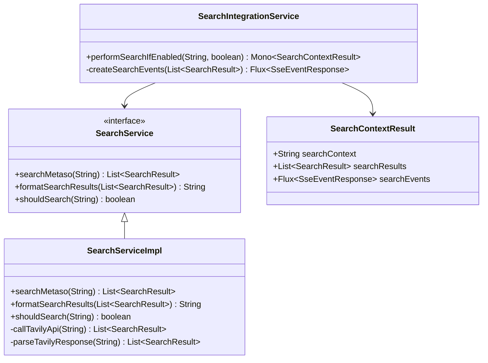
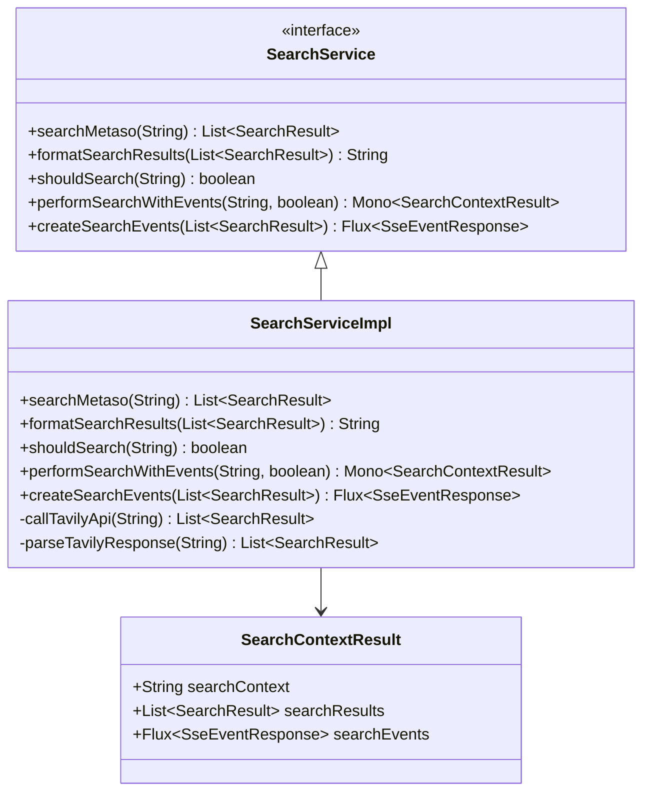

# 搜索服务整合重构设计

## 概述

本设计文档描述如何将 `SearchIntegrationService` 的功能整合到现有的 `SearchService` 接口和 `SearchServiceImpl` 实现类中，消除中间层，简化架构，并相应地重构单元测试。

## 重构目标

1. **简化架构**: 消除 `SearchIntegrationService` 中间层，减少代码复杂度
2. **功能整合**: 将响应式搜索和SSE事件流功能直接整合到核心搜索服务中
3. **保持接口一致性**: 确保上层调用方（如 `AiChatService`）的接口变更最小化
4. **测试覆盖**: 整合对应的单元测试，确保重构后的功能完整性
5. **代码规范**: 严格遵循阿里巴巴Java开发手册，确保代码质量和可维护性

## 当前架构分析

### 现有组件职责



### 问题分析

1. **架构冗余**: `SearchIntegrationService` 作为中间层，主要负责包装现有搜索功能
2. **职责分散**: 搜索相关的功能分散在两个不同的服务中
3. **依赖复杂**: 上层服务需要同时依赖两个搜索相关的服务

## 重构设计

### 目标架构



### 功能迁移计划

#### 1. 接口扩展

在 `SearchService` 接口中新增方法：

```java
/**
 * 执行搜索并返回包含事件流的结果
 * @param userMessage 用户消息
 * @param searchEnabled 是否启用搜索
 * @return 包含搜索上下文和事件流的响应式结果
 */
Mono<SearchContextResult> performSearchWithEvents(String userMessage, boolean searchEnabled);

/**
 * 创建搜索相关的SSE事件流
 * @param searchResults 搜索结果列表
 * @return SSE事件流
 */
Flux<SseEventResponse> createSearchEvents(List<SearchResult> searchResults);
```

#### 2. 实现类功能整合

在 `SearchServiceImpl` 中实现新增的方法，严格遵循阿里巴巴代码规范：

```java
/**
 * 执行搜索并返回包含事件流的结果
 * 
 * @param userMessage 用户消息，不能为null
 * @param searchEnabled 是否启用搜索
 * @return 包含搜索上下文和事件流的响应式结果，不会返回null
 */
@Override
public Mono<SearchContextResult> performSearchWithEvents(String userMessage, boolean searchEnabled) {
    // 【强制】参数校验
    if (userMessage == null) {
        throw new IllegalArgumentException("用户消息不能为null");
    }
    
    if (!searchEnabled) {
        return Mono.just(new SearchContextResult("", null, Flux.empty()));
    }

    // 【推荐】日志中避免字符串拼接，使用占位符
    String logMessage = userMessage.length() > MAX_LOG_MESSAGE_LENGTH 
        ? userMessage.substring(0, MAX_LOG_MESSAGE_LENGTH) 
        : userMessage;
    log.info("开始执行搜索，关键词: [{}]", logMessage);

    return Mono.fromCallable(() -> {
            List<SearchResult> searchResults = searchMetaso(userMessage);
            String searchContext = formatSearchResults(searchResults);
            Flux<SseEventResponse> searchEvents = createSearchEvents(searchResults);
            return new SearchContextResult(searchContext, searchResults, searchEvents);
        })
        .doOnNext(result -> {
            int resultCount = result.getSearchResults() != null ? result.getSearchResults().size() : 0;
            int contextLength = result.getSearchContext().length();
            log.debug("搜索完成，结果数量: [{}], 上下文长度: [{}]", resultCount, contextLength);
        })
        .onErrorReturn(new SearchContextResult("", null,
            Flux.just(SseEventResponse.error("搜索服务暂时不可用"))));
}

/**
 * 创建搜索相关的SSE事件流
 * 
 * @param searchResults 搜索结果列表，可以为null或空
 * @return SSE事件流，不会返回null
 */
@Override
public Flux<SseEventResponse> createSearchEvents(List<SearchResult> searchResults) {
    return Flux.concat(
        Mono.just(SseEventResponse.search("start")),
        Mono.justOrEmpty(searchResults)
            .filter(results -> !results.isEmpty())
            .map(SseEventResponse::searchResults),
        Mono.just(SseEventResponse.search("complete"))
    );
}
```

#### 3. 常量定义

```java
/**
 * 日志消息最大长度限制
 */
private static final int MAX_LOG_MESSAGE_LENGTH = 50;
```

#### 4. SearchContextResult 类设计

`SearchContextResult` 类作为内部数据结构保留，严格遵循阿里巴巴代码规范：

```java
/**
 * 搜索上下文结果数据传输对象
 * 
 * @author xupeng
 * @since 1.0
 */
public static class SearchContextResult {
    
    /** 搜索上下文文本 */
    private final String searchContext;
    
    /** 搜索结果列表 */
    private final List<SearchResult> searchResults;
    
    /** 搜索事件流 */
    private final Flux<SseEventResponse> searchEvents;

    /**
     * 构造函数
     * 
     * @param searchContext 搜索上下文，不能为null
     * @param searchResults 搜索结果列表，可以为null
     * @param searchEvents 搜索事件流，不能为null
     */
    public SearchContextResult(String searchContext, List<SearchResult> searchResults, 
                              Flux<SseEventResponse> searchEvents) {
        // 【强制】使用Objects.requireNonNull进行参数校验
        this.searchContext = Objects.requireNonNull(searchContext, "搜索上下文不能为null");
        this.searchResults = searchResults;
        this.searchEvents = Objects.requireNonNull(searchEvents, "搜索事件流不能为null");
    }

    /**
     * 获取搜索上下文
     * 
     * @return 搜索上下文，不会返回null
     */
    public String getSearchContext() {
        return searchContext;
    }

    /**
     * 获取搜索结果列表
     * 
     * @return 搜索结果列表，可能为null
     */
    public List<SearchResult> getSearchResults() {
        return searchResults;
    }

    /**
     * 获取搜索事件流
     * 
     * @return 搜索事件流，不会返回null
     */
    public Flux<SseEventResponse> getSearchEvents() {
        return searchEvents;
    }
}
```

### 依赖注入更新

上层服务（如 `AiChatServiceImpl`）的依赖注入需要更新，遵循阿里巴巴代码规范：

```java
/**
 * 搜索服务
 * 【推荐】使用构造器注入而非字段注入
 */
private final SearchService searchService;

/**
 * 构造函数注入
 * 
 * @param searchService 搜索服务，不能为null
 */
public AiChatServiceImpl(SearchService searchService) {
    this.searchService = Objects.requireNonNull(searchService, "搜索服务不能为null");
}

// 调用方式更新
// 原来: searchIntegrationService.performSearchIfEnabled(userMessage, searchEnabled)
// 更新后: searchService.performSearchWithEvents(userMessage, searchEnabled)
```

或者如果必须使用字段注入：

```java
/**
 * 搜索服务
 */
@Autowired
private SearchService searchService;
```

## 测试整合策略

### 测试文件合并

1. **保留**: `SearchServiceTest.java` 作为主要测试文件
2. **整合**: 将 `SearchIntegrationServiceTest.java` 中的测试用例迁移到 `SearchServiceTest.java`
3. **删除**: `SearchIntegrationServiceTest.java` 文件

### 测试用例分类

#### 原有功能测试（保留）
- 搜索触发条件测试
- 基础搜索功能测试
- 结果格式化测试
- 特殊查询测试

#### 新增功能测试（从SearchIntegrationServiceTest迁移）
- 响应式搜索测试
- SSE事件流测试
- 错误处理测试
- 搜索上下文结果测试

### 测试方法重构示例

遵循阿里巴巴代码规范的测试代码：

```java
/**
 * 测试启用搜索时的事件流功能
 */
@Test
void testPerformSearchWithEvents_SearchEnabled() {
    // Given
    String userMessage = "今天天气如何";
    List<SearchResult> mockResults = Arrays.asList(
        SearchResult.create("天气预报", "今天晴天", "https://weather.com", 0.9)
    );
    
    // 模拟内部方法调用
    when(searchService.searchMetaso(userMessage)).thenReturn(mockResults);
    
    // When & Then
    StepVerifier.create(searchService.performSearchWithEvents(userMessage, true))
        .expectNextMatches(result -> {
            // 【推荐】复杂断言拆分为多个简单断言
            boolean hasCorrectContext = result.getSearchContext().contains("搜索结果");
            boolean hasResults = result.getSearchResults() != null;
            boolean hasCorrectResultCount = result.getSearchResults().size() == 1;
            return hasCorrectContext && hasResults && hasCorrectResultCount;
        })
        .verifyComplete();
}

/**
 * 测试参数为null时的异常处理
 */
@Test
void testPerformSearchWithEvents_NullUserMessage() {
    // When & Then
    assertThrows(IllegalArgumentException.class, () -> {
        searchService.performSearchWithEvents(null, true);
    }, "用户消息为null时应抛出IllegalArgumentException");
}

/**
 * 测试搜索事件流创建功能
 */
@Test
void testCreateSearchEvents_WithResults() {
    // Given
    List<SearchResult> results = Arrays.asList(
        SearchResult.create("测试标题", "测试内容", "https://test.com", 0.9)
    );
    
    // When & Then
    StepVerifier.create(searchService.createSearchEvents(results))
        .expectNextMatches(event -> {
            return "search".equals(event.getType()) && 
                   event.getData().toString().contains("start");
        })
        .expectNextMatches(event -> {
            return "search_results".equals(event.getType());
        })
        .expectNextMatches(event -> {
            return "search".equals(event.getType()) && 
                   event.getData().toString().contains("complete");
        })
        .verifyComplete();
}

/**
 * 测试空结果列表的事件流创建
 */
@Test
void testCreateSearchEvents_WithEmptyResults() {
    // Given
    List<SearchResult> emptyResults = Collections.emptyList();
    
    // When & Then
    StepVerifier.create(searchService.createSearchEvents(emptyResults))
        .expectNextMatches(event -> "search".equals(event.getType()))
        .expectNextMatches(event -> "search".equals(event.getType()))
        .verifyComplete();
}

/**
 * 测试null结果列表的事件流创建
 */
@Test
void testCreateSearchEvents_WithNullResults() {
    // When & Then
    StepVerifier.create(searchService.createSearchEvents(null))
        .expectNextMatches(event -> "search".equals(event.getType()))
        .expectNextMatches(event -> "search".equals(event.getType()))
        .verifyComplete();
}
```

## 重构实施步骤

### 阶段1: 接口扩展与代码规范检查
1. 在 `SearchService` 接口中添加新方法，确保遵循阿里规范：
   - 【强制】方法名称使用lowerCamelCase风格
   - 【强制】所有参数和返回值必须有完整的JavaDoc注释
   - 【强制】使用@Nonnull和@Nullable注解明确参数和返回值的null安全性
2. 在 `SearchServiceImpl` 中提供默认实现
3. 运行现有测试确保兼容性
4. 使用PMD或SonarQube检查代码质量

### 阶段2: 功能迁移与规范实现
1. 将 `SearchIntegrationService` 的核心逻辑复制到 `SearchServiceImpl`，遵循以下规范：
   - 【强制】使用Objects.requireNonNull()进行参数校验
   - 【推荐】日志输出使用占位符而非字符串拼接
   - 【强制】所有魔法数字必须定义为常量
   - 【推荐】复杂的条件判断应该拆分为多个简单的boolean变量
2. 迁移 `SearchContextResult` 类到合适的包位置
3. 更新日志和异常处理，遵循阿里规范：
   - 【强制】异常信息必须有意义，不能出现空的catch块
   - 【推荐】使用统一的日志格式

### 阶段3: 调用方更新与依赖注入优化
1. 更新 `AiChatServiceImpl` 中的依赖注入，遵循以下规范：
   - 【推荐】优先使用构造器注入而非字段注入
   - 【强制】使用final修饰依赖的字段
   - 【强制】在构造函数中进行参数非null校验
2. 修改相关的方法调用
3. 运行集成测试验证功能

### 阶段4: 测试整合与质量保证
1. 迁移测试用例到 `SearchServiceTest`，遵循阿里规范：
   - 【强制】测试方法名称必须清晰表达测试意图
   - 【推荐】使用Given-When-Then结构组织测试代码
   - 【强制】必须有针对异常情况的测试用例
   - 【推荐】复杂的断言应该拆分为多个简单的断言
2. 删除 `SearchIntegrationServiceTest` 文件
3. 运行完整测试套件，确保覆盖率不低于85%
4. 使用JaCoCo检查测试覆盖率

### 阶段5: 清理与文档更新
1. 删除 `SearchIntegrationService` 类文件
2. 更新相关的依赖配置
3. 更新文档和注释，遵循阿里规范：
   - 【强制】所有public类和方法必须有JavaDoc注释
   - 【推荐】注释应该说明“做什么”而不是“怎么做”
   - 【强制】禁止使用单行注释//来注释整个方法或类
4. 使用Checkstyle检查代码风格符合性

## 风险评估与对策

### 潜在风险
1. **接口变更影响**: 上层调用方需要适配新接口
2. **测试覆盖率**: 确保迁移过程中不丢失测试覆盖
3. **响应式编程**: 需要确保Mono/Flux的正确使用

### 对策措施
1. **渐进式迁移**: 保持向后兼容性，逐步迁移
2. **完整测试**: 在每个阶段都运行完整的测试套件
3. **代码审查**: 重点关注响应式编程的正确性

## 重构收益

1. **架构简化**: 减少一个服务层，降低系统复杂度
2. **维护性提升**: 搜索相关功能集中在一个服务中
3. **性能优化**: 减少对象创建和方法调用开销
4. **测试集中**: 所有搜索相关测试集中在一个测试类中
5. **代码质量提升**: 遵循阿里巴巴代码规范，提高代码可读性和可维护性

## 后续优化建议

1. **接口优化**: 考虑是否需要进一步简化搜索接口
2. **性能监控**: 添加搜索性能指标监控
3. **缓存机制**: 考虑为搜索结果添加缓存策略
4. **配置优化**: 统一搜索相关的配置管理
5. **代码质量持续改进**: 
   - 定期使用静态分析工具检查代码
   - 定期更新依赖库到最新版本
   - 持续关注阿里巴巴规范的更新和最佳实践