# 服务层整合优化设计

## 1. 概览

### 1.1 优化目标
将`MessagePersistenceService`、`ChatStreamService`、`ConversationManagementService`三个辅助服务类的功能整合到已有的核心服务接口中，优化服务层次结构，减少不必要的服务类，提升代码可维护性。

### 1.2 当前架构问题
- **服务层过于碎片化**：存在多个功能相近的服务类，职责边界不清晰
- **依赖关系复杂**：`AiChatServiceImpl`依赖多个辅助服务，形成复杂的依赖链
- **代码重复**：响应式包装、错误处理等逻辑在多个服务中重复出现
- **测试复杂度高**：需要mock多个服务依赖，测试设置复杂

## 2. 服务整合分析

### 2.1 服务功能分析

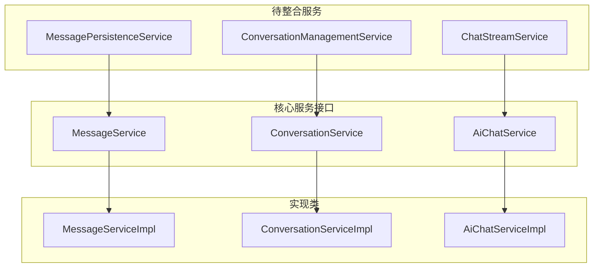

| 待整合服务 | 核心功能 | 目标整合位置 | 整合理由 |
|-----------|---------|-------------|---------|
| `MessagePersistenceService` | 消息持久化、响应式包装 | `MessageService` | 功能高度重叠，都是消息相关操作 |
| `ConversationManagementService` | 对话标题生成、对话管理 | `ConversationService` | 都是对话管理相关功能 |
| `ChatStreamService` | 流式聊天协调、错误处理 | `AiChatService` | 都是AI聊天核心流程 |

### 2.2 方法整合映射

#### MessagePersistenceService → MessageService
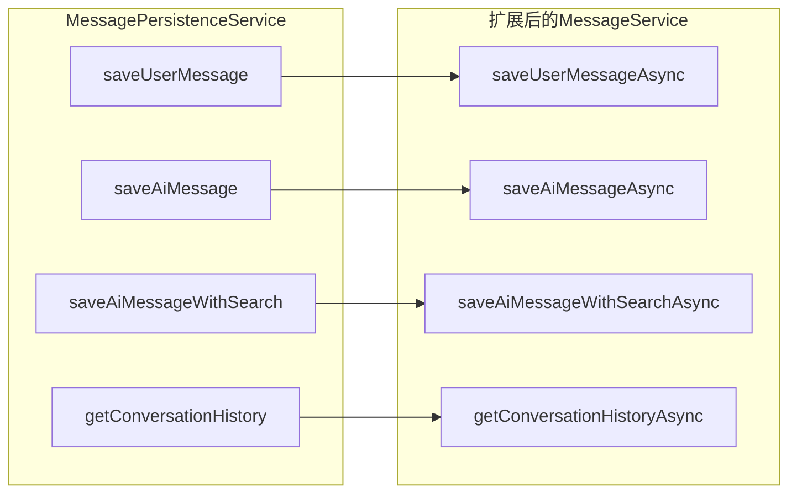

#### ConversationManagementService → ConversationService
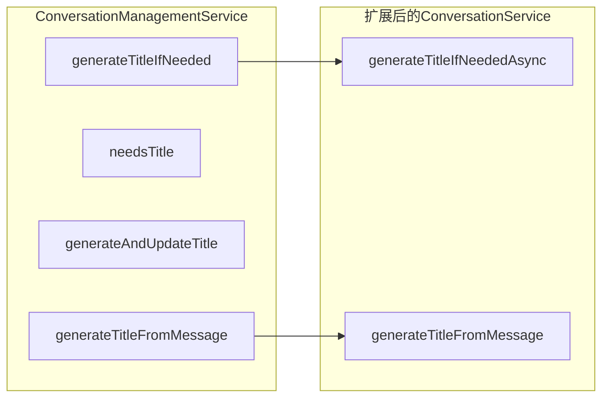

#### ChatStreamService → AiChatService
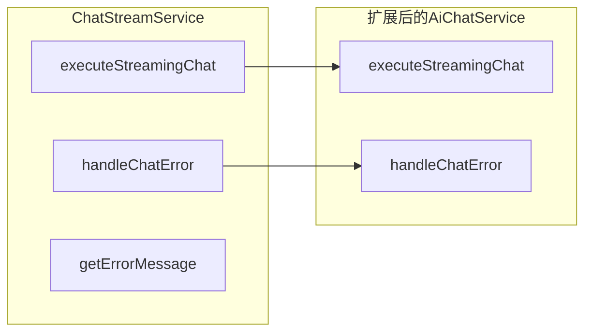

## 3. 接口设计

### 3.1 MessageService 接口扩展

```java
public interface MessageService {
    // 原有同步方法保持不变
    Message saveMessage(Long conversationId, String role, String content);
    Message saveMessage(Long conversationId, String role, String content, String searchResults);
    Message saveMessage(Long conversationId, String role, String content, String thinking, String searchResults);
    
    // 新增响应式方法
    Mono<Message> saveUserMessageAsync(Long conversationId, String content);
    Mono<SseEventResponse> saveAiMessageAsync(Long conversationId, String content, String thinking);
    Mono<SseEventResponse> saveAiMessageWithSearchAsync(Long conversationId, String content, 
                                                       String thinking, List<?> searchResults);
    Mono<List<Message>> getConversationHistoryAsync(Long conversationId);
}
```

### 3.2 ConversationService 接口扩展

```java
public interface ConversationService {
    // 原有方法保持不变
    Conversation createConversation(Long userId, String title);
    Conversation getConversationById(Long conversationId);
    // ... 其他原有方法
    
    // 新增标题管理方法
    Mono<Void> generateTitleIfNeededAsync(Long conversationId, String userMessage);
    String generateTitleFromMessage(String message);
}
```

### 3.3 AiChatService 接口扩展

```java
public interface AiChatService {
    // 原有方法保持不变
    Flux<SseEventResponse> streamChat(Long conversationId, String userMessage, 
                                    boolean searchEnabled, boolean deepThinking);
    
    // 新增内部流式处理方法
    Flux<SseEventResponse> executeStreamingChat(String prompt, Long conversationId, boolean deepThinking);
    Flux<SseEventResponse> handleChatError(Throwable error);
}
```

## 4. 实现类重构设计

### 4.1 MessageServiceImpl 重构

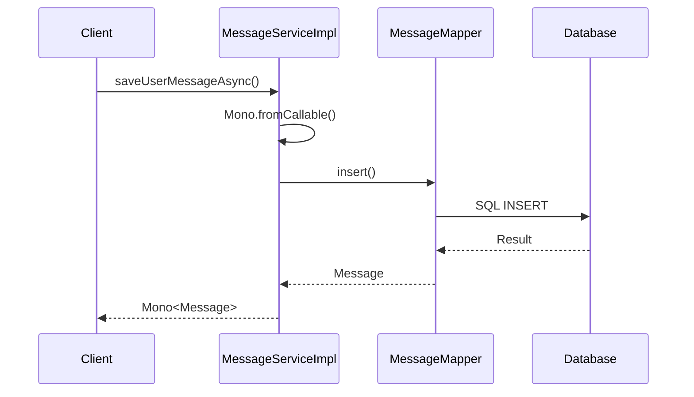

**重构要点：**
- 集成`MessagePersistenceService`的响应式包装逻辑
- 保持原有同步方法，新增异步方法
- 统一错误处理和日志记录
- 保持数据访问层不变

### 4.2 ConversationServiceImpl 重构

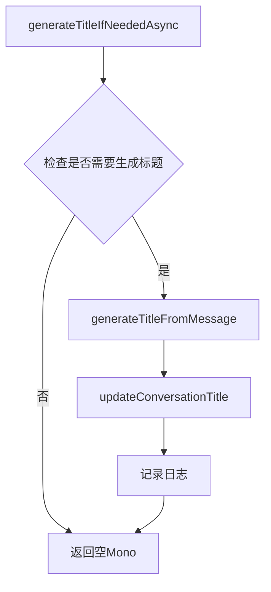

**重构要点：**
- 整合标题生成逻辑
- 保持智能标题生成算法
- 添加响应式异步支持
- 完善错误处理机制

### 4.3 AiChatServiceImpl 重构

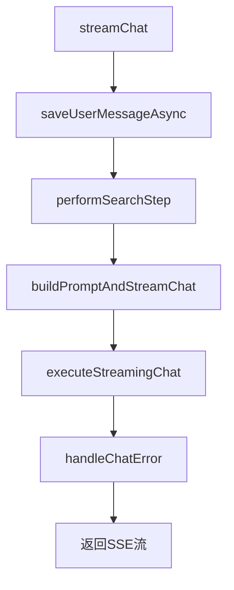

**重构要点：**
- 内置流式聊天处理逻辑
- 简化依赖注入
- 统一错误处理策略
- 保持响应式编程模式

## 5. 依赖关系优化

### 5.1 重构前依赖关系

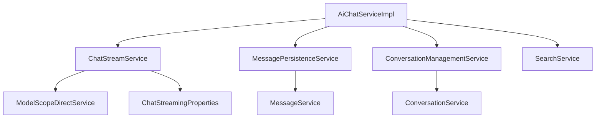

### 5.2 重构后依赖关系

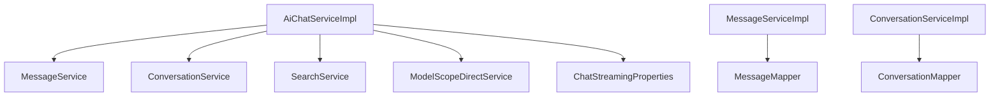

**优化效果：**
- 减少3个中间服务层
- 简化依赖链路
- 降低循环依赖风险
- 提升代码可读性

## 6. 测试策略重构

### 6.1 测试文件重构计划

| 原测试文件 | 重构后归属 | 重构策略 |
|-----------|-----------|---------|
| `ChatStreamServiceTest.java` | `AiChatServiceImplTest.java` | 合并到AI聊天服务测试 |
| `MessagePersistenceServiceTest.java` | `MessageServiceTest.java` | 合并到消息服务测试 |
| `ConversationManagementServiceTest.java` | `ConversationServiceTest.java` | 合并到会话服务测试 |

### 6.2 测试用例迁移设计

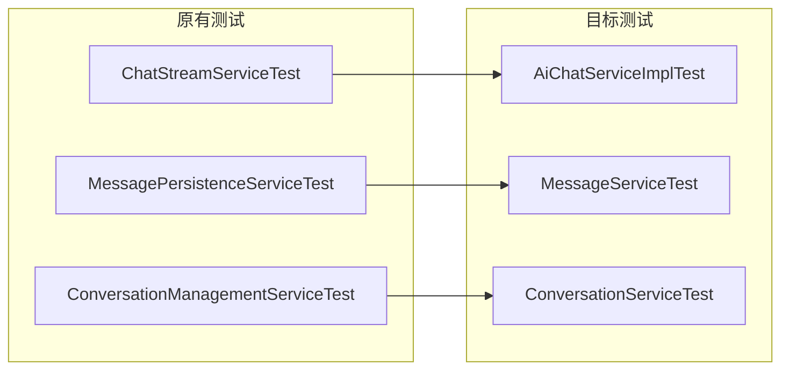

**测试迁移原则：**
- 保持原有测试覆盖率
- 更新Mock对象配置
- 合并重复测试场景
- 增加新方法的测试用例

### 6.3 Mock配置简化

**重构前：**
```java
@MockBean private ChatStreamService chatStreamService;
@MockBean private MessagePersistenceService messagePersistenceService;
@MockBean private ConversationManagementService conversationManagementService;
@MockBean private SearchService searchService;
```

**重构后：**
```java
@MockBean private MessageService messageService;
@MockBean private ConversationService conversationService;
@MockBean private SearchService searchService;
@MockBean private ModelScopeDirectService modelScopeDirectService;
```

## 7. 实施计划

### 7.1 实施阶段

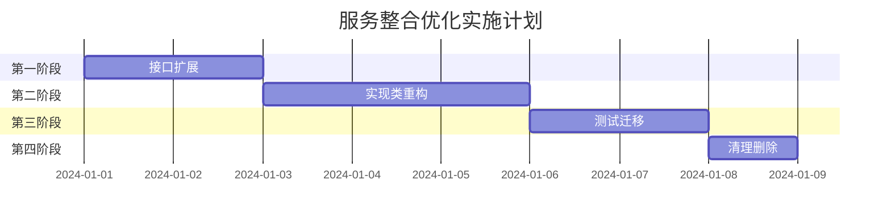

### 7.2 风险控制

| 风险点 | 影响程度 | 应对策略 |
|-------|---------|---------|
| 测试覆盖率下降 | 高 | 先迁移测试，再重构代码 |
| 功能回归 | 中 | 保持原方法向后兼容 |
| 性能影响 | 低 | 基准测试验证 |

### 7.3 验收标准

- [ ] 所有原有功能保持不变
- [ ] 测试覆盖率≥95%
- [ ] 删除3个中间服务类
- [ ] 依赖关系简化
- [ ] 代码审查通过

## 8. 配置变更

### 8.1 Spring配置更新
由于服务整合，需要确保Spring容器正确注入新的依赖关系。主要变更：

- 移除`@Component`注解：`ChatStreamService`、`MessagePersistenceService`、`ConversationManagementService`
- 更新`AiChatServiceImpl`的依赖注入配置
- 确保配置类`ChatStreamingProperties`正确注入到`AiChatServiceImpl`

### 8.2 日志配置优化
统一服务层日志格式，便于问题追踪：

```yaml
logging:
  level:
    com.example.service.impl: DEBUG
  pattern:
    console: "%d{yyyy-MM-dd HH:mm:ss} [%thread] %-5level [%X{conversationId}] %logger{36} - %msg%n"
```