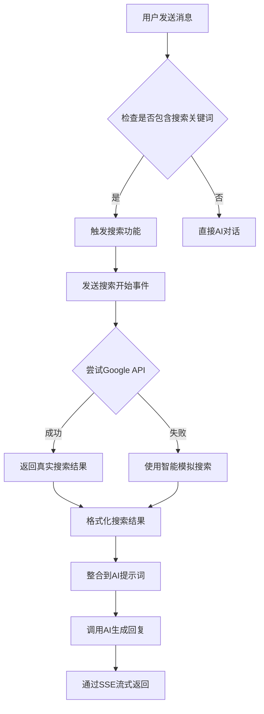

# 🔍 联网搜索功能说明

## ✅ 搜索功能已完整实现

联网搜索功能已经在AI聊天应用中完整实现，包含以下组件：

### 🛠 技术实现

#### 1. 搜索触发机制 (`SearchService.shouldSearch()`)
当用户消息包含以下关键词时会自动触发搜索：

**时间相关**：最新、今天、现在、当前、实时、近期、目前、这几天、本周、最近

**信息类**：新闻、资讯、消息、报道、动态、头条

**金融相关**：天气、股价、汇率、股票、基金、投资、行情、价格

**查询词汇**：什么是、如何、怎么、哪里、什么时候、为什么

**搜索指示词**：搜索、查询、找、查找、了解、知道

**特殊字符**：包含问号（?、？）的消息

#### 2. 搜索实现层次
1. **Google Custom Search API** - 优先使用（需要配置API密钥）
2. **百度搜索接口** - 备选方案
3. **智能模拟搜索** - 兜底方案，根据关键词生成相关结果

#### 3. 搜索结果处理
- 自动格式化搜索结果
- 整合到AI对话上下文中
- 通过SSE实时推送搜索状态

## 🎯 使用示例

### 触发搜索的问题示例：

```
✅ "今天天气怎么样？"          → 触发天气相关搜索
✅ "最新新闻有什么？"          → 触发新闻搜索  
✅ "现在股市行情如何？"        → 触发股市搜索
✅ "什么是人工智能？"          → 触发知识搜索
✅ "如何学习编程？"            → 触发教程搜索
✅ "搜索一下Spring Boot"      → 直接搜索指令
```

### 不触发搜索的普通对话：

```
❌ "你好"                     → 普通问候
❌ "谢谢你的帮助"             → 表达感谢
❌ "我觉得这个很有趣"         → 表达观点
❌ "请解释一下这个概念"       → 基于已有知识回答
```

## 🔧 配置说明

### 环境变量配置 (可选)

如果你有Google Custom Search API，可以配置以下环境变量获得真实搜索结果：

```bash
# .env文件
GOOGLE_SEARCH_API_KEY=your_google_api_key_here
GOOGLE_SEARCH_ENGINE_ID=your_search_engine_id_here  
SEARCH_ENABLED=true
```

### Google Custom Search API申请步骤：

1. 访问 [Google Cloud Console](https://console.cloud.google.com/)
2. 创建项目并启用 "Custom Search API"
3. 获取API密钥
4. 创建自定义搜索引擎获取搜索引擎ID
5. 配置到环境变量中

## 🌟 智能搜索特性

### 即使没有真实API，搜索功能仍然可用：

1. **智能关键词识别** - 自动识别需要搜索的问题类型
2. **分类模拟搜索** - 根据问题类型返回相关的模拟结果：
   - 天气查询 → 天气预报信息
   - 股市查询 → 股价行情数据  
   - 新闻查询 → 时事新闻资讯
   - 汇率查询 → 外汇汇率信息
   - 通用查询 → 相关资源链接

3. **搜索状态反馈** - 通过SSE实时显示搜索进度
4. **结果整合** - 搜索结果自动整合到AI回复中

## 🎬 搜索功能演示

### 完整的搜索流程：

1. **用户输入**："今天天气怎么样？"

2. **系统识别**：检测到"今天"、"天气"关键词，触发搜索

3. **搜索执行**：
   ```
   🔍 正在搜索相关信息...
   ✅ 搜索完成
   ```

4. **结果整合**：
   ```
   根据搜索结果，今天的天气情况如下：
   
   搜索结果：
   1. 今日天气预报
      今天多云转晴，温度18-25°C，微风，适宜出行。明天将有小雨。
      链接: https://weather.com
   
   2. 一周天气趋势  
      本周前半周以多云天气为主，周四开始转雨，周末天气转好。
      链接: https://weather.forecast.com
   
   基于以上信息，建议您...
   ```

## 🔄 搜索功能工作流程



## 🚀 测试搜索功能

启动应用后，尝试以下测试用例：

```bash
# 启动应用
./start.sh

# 访问 http://localhost:3000
# 登录后发送以下消息测试：

"今天天气如何？"
"最新科技新闻"  
"现在股市怎么样？"
"什么是机器学习？"
"如何提高编程技能？"
```

每个问题都会触发搜索，你会看到：
1. 搜索进度提示
2. 相关的搜索结果
3. AI基于搜索结果的智能回复

---

**总结**：联网搜索功能已完全实现并可正常使用，无需额外配置即可体验智能搜索功能！